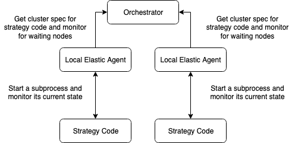
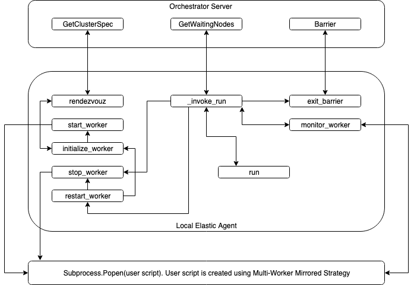

# TensorFlow Elastic Training Design (Alpha)

Repo: https://github.com/sboshin/tensorflow_elastic/tree/grpcbased

The Alpha version of the TensorFlow Elastic Training follows the etcd version created by pytorch. This relies on an external server, which coordinates hosts being added and removed from the cluster. The server is grpc based, and has no external dependencies.



An elastic job is run in two phases. 

Setup the Server

```
python -m tensorflow_elastic.distributed.launch --standalone --rdzv_endpoint=localhost:[open external port] ls 
```

The server should be setup on a small, but accessible instance to your cluster. An instance that won’t be brought down by interruptions. The only setting that needs to be passed is the external port for the server to use.

For each worker

```
python3 -m tensorflow_elastic.distributed.launch --monitor_interval=[int] --address=`hostname -i`:[external port] --nnodes=[min nodes: max nodes] --rdzv_endpoint=[hostname:port to orchestrator server] [script to run and args]
```

For each node that will join the cluster, run the above command, and setup your open port.
**monitor_interval**: This is how often you want your node to poll the server and its process
**address**: this is the node address and open external port
**nnodes**: a range of min to max nodes
**rdzv_endpoint**: This is the address to the orchestrator server
The remaining is the script to run (That is created with MWMS)

## Tutorial

**Install bazel**
wget https://github.com/bazelbuild/bazelisk/releases/download/v1.6.1/bazelisk-linux-amd64 -O /usr/local/bin/bazel

**Install tensorflow_elastic**

* git clone -b grpcbased https://github.com/sboshin/tensorflow_elastic
* cd tensorflow_elastic
* chmod +x ./install.sh
* ./install.sh

```
#Start The Orchestrator
python -m tensorflow_elastic.distributed.launch --standalone --rdzv_endpoint=localhost:5555 start  &> orchestrator_log.txt&

#Start 3 nodes on the same instance
python -m tensorflow_elastic.distributed.launch --standalone --rdzv_endpoint=localhost:5555 start
```



### Server Design

* GetClusterSpec
    * Input: address, min_nodes, max_nodes, reset
        * address: address of node trying to connect to clusterr
        * min_nodes and max_nodes used as verification you belong to the cluster (Not secure), and also parameters for gathering
        * reset: Not used
    * Output: clusterspec as string (without setting task index)
    * Basic rendezvous algorithm
    * Add address, and time stamp of when address was added. Block until min nodes achieved. After min nodes, wait for a gather timeout. If gather timeout expires, continue. Before returning, add timestamp and return this cluster spec. 
    * If clusterspec has already been returned, and extra nodes join. They will add themselves to the number of nodes waiting, and block
* GetWaitingNodes
    * Input: address
        * address: address of node trying to get waiting nodes
    * Output: number of waiting nodes (+ means nodes are added, - mean nodes were removed)
    * Algorithm
        * When the address is initially registered, we log a time stamp
        * We expect this timestamp to be renewed by polling getwaitingnodes.
        * If timestamp isn’t renewed, We consider this node unresponsive, and other threads will see a negative value, which will trigger a call to GetClusterSpec
* Barrier
    * Input: address
        * address: address of node trying to join barrier
    * Output: Barrier success, and error message
    * Algorithm
        * All workers registered by “getClusterSpec” should join the barrier.
        * Check if address is registered, wait until either timeout or all addresses have entered barrier

### Local Agent Design

* Start Workers
    * This will start the user script inside a subprocess
* Stop Workers
    * This will kill the subprocess the user script is running in
* Monitor Workers
    * Checks the state of the subprocess
    * Returns a state of Success, Healthy, or Failed
* SimpleElasticAgent(Base Class)
    * rendezvous
        * Attempts to coordinate with other workers available in the cluster
        * Sets the ClusterSpec for the current available cluster
    * initialize workers
        * Rendezvous and start worker
    * restart workers
        * Stop, Rendezvous, Start worker
    * run
        * Starts the local agent (invoke_run)
    * invoke run
        * Main loop
            * monitor worker
            * if success
                * exit_barrier
            * if healthy
                * if nodes are waiting
                    * restart
            * if unhealthy or failed
                * if we still can restart, restart
                * else stop workers and enter exit barrier
    * exit barrier
        * barrier call to synchronize that workers have finished

## Missing Features ([Data supported in Elastic benchmarks](testing.md))

1. Formalize Recovery mechanism
    * Currently using BackupandRestore modified
    * Move to Orchestrator recovery
2. Mid Epoch recovery 
    * Losing up to 2x non 1st epoch time
    * Save/restore multi-device iterator
    * Elastic Iterator
        * 2 iterators with 2 workers, will put next index @ 3
        * Next 2 iterations with 3 workers should start from 3, and end at 9
3. Restart workers without killing process
    * Incuring Epoch loss, Incurring 1st epoch slowdown which is up to 5-6x epoch time
    * Reset Eager context
    * Retrace already registered functions
    * Restore state from a process that wasn't changed
4. Formalize Orchestrator API
    * Current Workers: But this can currently be done through TF_CONFIG or cluster resolver
    * Help with hyperparameters dependent on number of workers
5. Formalize Metrics API


## Testing

### Elastic training test (bazel)

* tf_config
    * Check if TF_CONFIG is properly setup
* tf_config_growth
    * Check if TF_CONFIG is properly setup after increasing the cluster
* tf_config_shrink
    * Check if TF_CONFIG is properly setup after reducing the cluster
* Collectiveallreduce_variable
    * Check if Variable synced across cluster properly reflects the cluster state
    * Start with 2 nodes, growth to 3, and reduce back to 2
* mnistElastic
    * Run a Keras model on MNIST dataset, start with 2, grow to 3, and reduce back to 2
* resnetApplications:
    * Resnet keras model, for limited number of epochs with cifar dataset

### Orchestrator Server Test (bazel)

* bringup
    * Test bringing up the server
* single_connect
    * test GetClusterSpec with one node
* multi_connect
    * test GetClusterSpec with multiple nodes
* waiting_workers
    * test GetClustetrSpec and GetWaitingNodes by starting the server, getting the clusterspec and adding a new worker
* reset_workers
    * GetClusterSpec → GetWaitingNodes → GetClusterSpec
* synchronize
    * Test Synchronize API
* synchronize_fail
    * Test timeout on Synchronize
* barrier
    * Test Barrier API
* barrier_fail
    * Test timeout on Barrier


