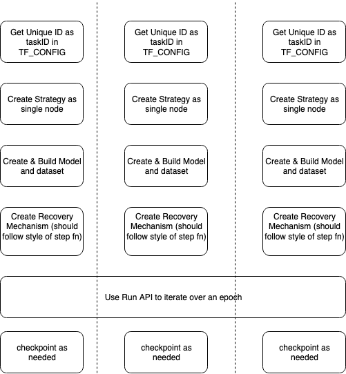
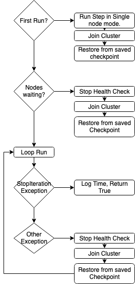

# TensorFlow Elastic Training (In-Process Restart)

Repository:

The In-Process Restart design aims to improve the time taken to continue training after an error.

From the previous benchmarking effort done on the alpha, there is a significant issue when recovering from an error. These performance impacts can be broken down into 3 parts. 

1. Lost Epoch time
    * The amount of time spent on an epoch before a failure occurred.
2. Script Setup time
    * The amount of time taken in the script to reach the training step
    * This includes time it takes to setup the cluster with the orchestrator
3. TF initialization time
    * This is the time TF takes to initialize the model
    * This includes XLA, Variable initialization, tracing, loading a checkpoint, etc

## Quantifying Performance impact
In the first iteration of TensorFlow Elastic, there were 3 main performance impacts. 
1. Setup
2. First Step (2nd step)
3. Effort after last checkpoint

From earlier [benchmarking efforts](testing.md) there is a significant loss of time in the setup aspect of a training script (25 to 50 secs). This includes creating the dataset, starting the strategy code, and setting up various training code. 

Another known TF limitation is the first step slowdown. This first step takes care of alot of initialization and tracing, and another compounding issue is that tracing is done serially for each GPU on the host, the more GPUs the longer it takes. In the previous benchmarking example the first epoch took about 360 seconds, upon each restart this first epoch slowdown will happen further reducing performance.

The last performance impact is caused by the loss of work after checkpointing. This loss of work is at most time spent between checkpoints, and can be reduced by checkpointing more frequently.

## In Process Restart Design

To alleviate the first 2 performance issues, I propose an in-process restart. This mechanism will allow for nodes that are already up and running to not be hit by the setup performance hit, and also siginificantly reduce the first step performance hit. This happens because the training step function is able to recover inside the process, and re-establish the cluster without tearing down the process. Estimates from the previous benchmarking effort show saving about 350 seconds (25 seconds for setup and 320 seconds first step) per cluster change. 

In Process Restart Design brings a new API to the elastic design. To make in-process requires user code changes to enable in-process and to use the new Run api, which will handle error recovery and cluster changes.

The two main APIs for in-process restart:

1. init()
   * This will connect the process to the orchestrator and get a unique id
2. Run() 
   * Run is the main api, which will take your strategy wrapped function, and run it elastically. It will handle recovery and cluster changes. 

# Init

The init API is meant to allow individual nodes to initialize properly without having issues when joining the cluster. It allows a node to have a unique id throughout the training job so no two workers clash. This avoids nodes with the same task ids and allows a unique way of identifying a chief. A chief becomes the lowest task id in the cluster. This means for each cluster change the roles could change.

## Design

* Get a handler for the orchestrator
* Get a Unique ID 
* Set the TF_CONFIG env as a single node with a unique id (Sparse Map)

# Run

The Run API is meant to consolidate all the process of training elastically. This allows a step function to run and be able to recover. 

## Design

* First run
  * Run the step function
  * Restore to known good checkpoint
  * Join the cluster
* Loop run
  * Raised StopIteration?
    * Dataset has been exhausted, return successfully
  * Raised other exception?
    * Treat as a failure
    * Everyone join the cluster
    * Restore from saved checkpoint

The in-proces design relies on 2 major functions, being able to change the cluster definition of the TF server and being able to warm-up nodes prior to nodes joining the cluster. 

### Changing cluster definition

When a cluster change is needed, the current method is to tear down all workers and rebuild the process to start from the last saved checkpoint. This wastes time by losing any cached executors and also restarting any setup done.

Instead of a full tear down, we utilize the initialization routines (enable_collective_ops) of the eager context to update the grpc server.

For In Process Restart to work, there are a few changes to TF that need to be made. 

1. Create and Update Cluster Process
2. Update Collective group size (this might be alleviated with CollectivesV2)
3. Use Sparse ClusterSpec
4. Remove In device all reduce shortcut

**Caveats**

Collectives in TF have a few attributes that are set on Operator creation, this is in the process of being changed with the CollectivesV2 effort; This would then be an input. Due to this limitation, each node needs to have a coordinated run, where the collectivekeys are in sync. This causes a few changes in TF. 
1. No shortcut for in node communication
2. Using tf.function should be applied to both the saving mechanism and step function.

## Warming up nodes

There are 2 types of cluster changes, nodes joining or nodes leaving. When nodes leave, the cluster will only need to adjust the cluster specification and load from previous known good state. But when a node is joining the cluster, the new node will also have that first step slow down, which can be massive. Instead of slowing down the whole cluster, the node is warmed up by running the step fn prior to joining the cluster. Once we join the cluster, the model is loaded from the last saved checkpoint. From benchmarks, this warmup reduces step 0 to 1/3 of the old time. 

# Benchmark

## In-process Restart

|	|Process Teardown	|In-Process Restart	|
|---	|---	|---	|
|Script Setup	|54	|38	|
|First run	|	|282	|
|Epoch 0	|386	|144	|
|Step 0	|297	|51	|
|Epoch 1	|90	|93	|
|lost epoch 2	|37.2	|22	|
|recover	|35	|70	|
|setup	|31	|	|
|epoch 2	|257	|162	|
|Step 0	|142	|48	|
|Epoch 3	|118	|120	|
|... to growth	|	|	|
|recover	|3	|29	|
|setup	|31	|	|
|epoch time	|233	|170	|
|Step 0	|142	|50	|
|

#
# Conclusion
The biggest benefit as shown in the benchmark is on the first step, which is about 1/3 of the full process tear down. The second benefit is avoiding the setup script time. In the benchmark it isn't as clear cut because the recovery time in the in-process cluster is mainly dominiated by trying to stop the health check thread (about 30 sec). This can potentially be reduced by using a custom health check method, or reducing the health check interval in tensorflow.